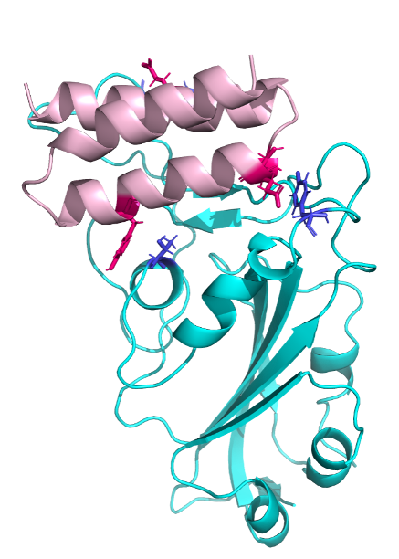

# Pre-College Rosetta Internship Opportunity
The Pre-College Rosetta Internship Opportunity (PCR-IO) program engaged rising senior high school students in a protein therapeutic design project in which they produced novel structural models using PyRosetta and Foldit software packages. The mission of PCR-IO was to offer a program to increase equitable access to computational biomolecular work. This Github project serves as a repository for the teaching and learning materials developed in the program.

Follow along and explore the steps of this interactive workflow illustrating our resource hub that will take you or your students from protein folding basics to complex structural analysis.

## Getting Started

This module workflow will give you the opportunity to investigate mutations in a protein system that you think might optimize, disrupt, or affect the system in some capacity! In the guides, slidedecks, and Google Colab workbooks linked, you'll see that we are working with a SARS-CoV2 miniprotein binder. However, these resources can easily be adapted to work with other protein systems.

Figure showing completed project. Mini-protein binder redesign (pink) with interacting residues highlighted (red sticks) and SARS-CoV-2 variant receptor binding domain (cyan). Image credit PCR-IO student: R. Bhagat 2021.
